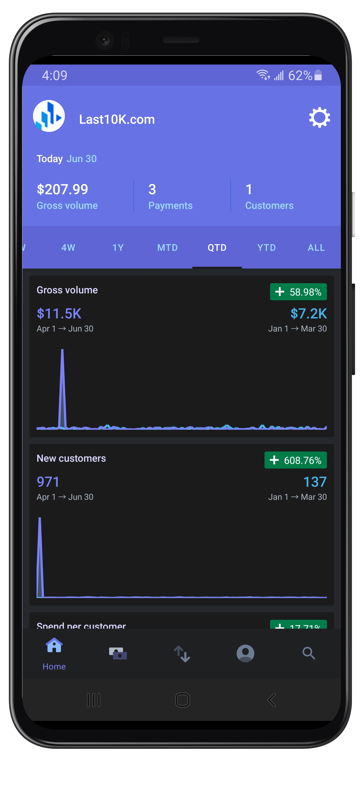
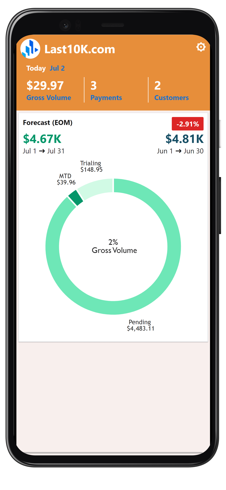
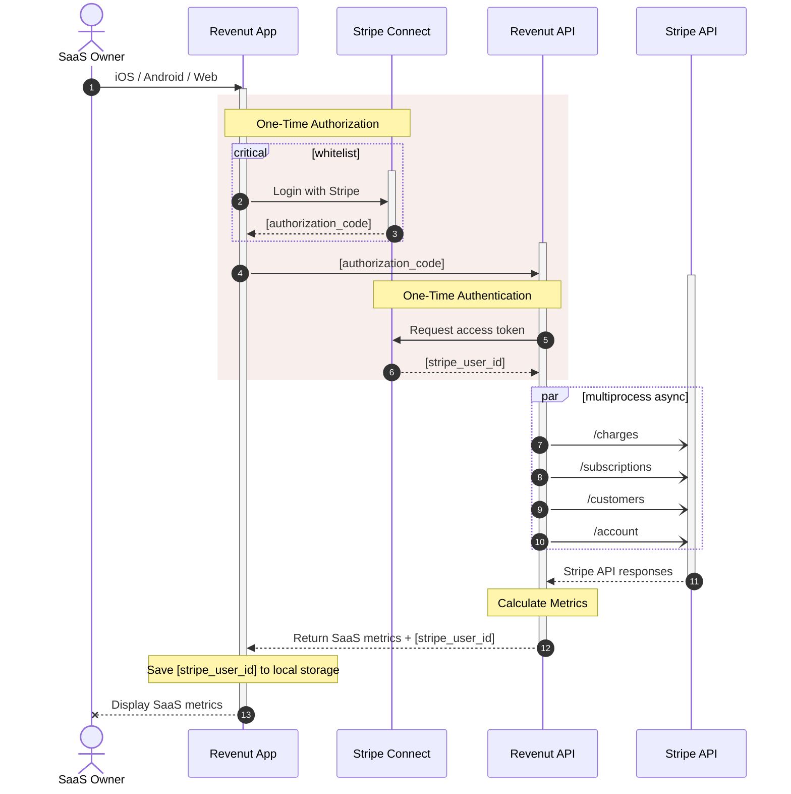
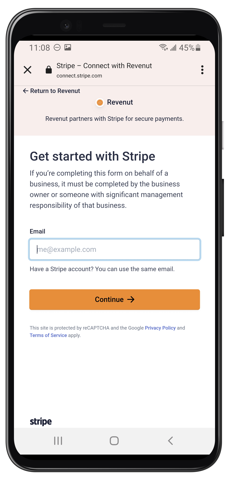
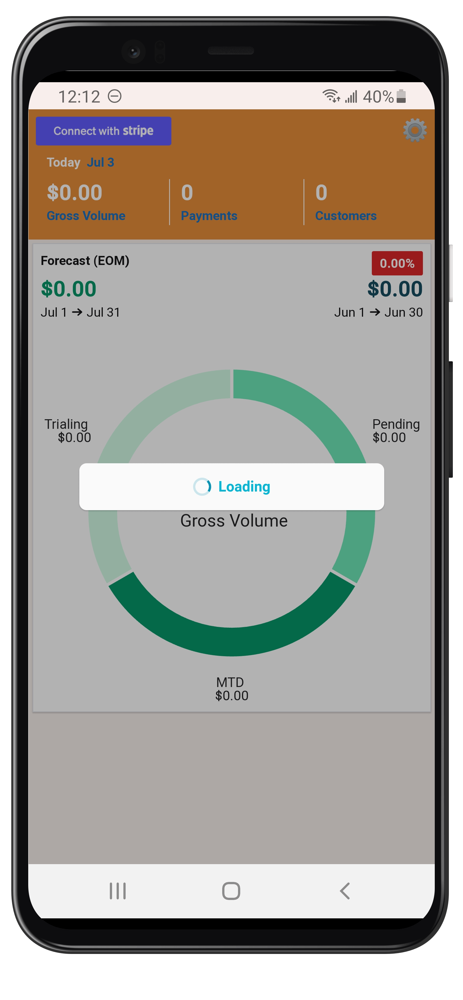

  <a href="https://revenut.com/" style="color: black;">
    
    <h1>Revenut</h1>
  </a>

  <!-- iOS -->
  
  <!-- Android -->
  
  <!-- Web -->
  

  <h3 align="center">SaaS Metrics in a Nutshell</h3>
  <a href="https://github.com/hbcondo/revenut-app/wiki">Wiki</a> | <a href="https://app.revenut.com">Demo</a>

---
> By Amar Kota - [Hire me](https://amarkota.com/resume)

Revenut is being created as an open source alternative to [Stripe's mobile app](https://support.stripe.com/questions/stripe-iphone-and-android-mobile-apps-mobile-dashboard-app-for-standard-direct-users) after my SaaS[^1] experienced fraudulent activity in the form of [card testing](https://stripe.com/docs/disputes/prevention/card-testing). Many other Stripe customers have voiced their problems with card testing too[^2][^3] and although Stripe confirmed card testing has ceased on my website, the problem persists where fraudulent transactions and customers are still included in Stripe's mobile app reporting. As a result, the numbers and charts displayed simply do not reflect actuals. 

Unfortunately Stripe is unable to [modify the revenue data or financial reports on the dashboard at this point](docs/assets/Revenut-Screenshot-Stripe-Email.png) so the Stripe mobile app, as convenient and fast as it is, does not accurately display metrics including `Gross Volume` and `New Customers`. 

I looked into using another SaaS analytics service but they all charge a premium amount and still do not provide some of the metrics I find useful for my freemium business model. I then decided to build Revenut and open-source it so fellow SaaS owners can get accurate and transparent SaaS metrics conveniently at no cost.

|  Stripe        |  Revenut       |
|     :---:      |     :---:      |
|  |      |

#  ❔ Use Case
SaaS owners who offer free trials on their products and have recurring revenue in monthly, annual or other scheduled installments. 

#  ✨ Features
- Exclude disputed and refunded transactions for accurate revenue reporting
- Login with existing Stripe username/password
- Calculates unrealized ("paper") revenue based on the number of customers trialing your product
- Calculates unrealized revenue for existing customers that are scheduled to pay their upcoming invoice
- Calculates realized revenue for customers who paid their invoice
- Logging out revokes access from Revenut

#  💻 Built With
- [`FastAPI`](https://fastapi.tiangolo.com/) `Python`
- [`Expo`](https://expo.dev) `React Native + Typescript`
- [`Victory`](https://formidable.com/open-source/victory/)
- [`NativeBase`](https://nativebase.io/)
- [`MyBrandNewLogo`](https://mybrandnewlogo.com/)
- [`Namelix`](https://namelix.com)
- [`MockuPhone`](https://mockuphone.com/)

#  🏃 Workflow

#  🚦 Authentication
Revenut uses Expo's built-in [Authentication package](https://docs.expo.dev/develop/authentication/) that has been configured to use [Stripe's browser-based authentication via OAuth](https://stripe.com/docs/connect/oauth-reference). This allows Stripe users to login with their existing Stripe credentials securely so Revenut can retrieve data required to formulate its metrics.

#  🙋 Challenges
The metrics Revenut displays requires retrieving two months of charges (for month-to-date and month-over-month comparisons) using Stripe's API, which can result in long loading times because: 

> ...listing charges (or most resources) can be quite slow as you need to render many objects. The Charge API especially is quite a large object to render and paginate through.

Source: [https://github.com/stripe/stripe-dotnet/issues/2284#issuecomment-777192698](https://github.com/stripe/stripe-dotnet/issues/2284#issuecomment-777192698)

#  👪 Contributing
If you like Revenut, **please star this repo**. If you want to make Revenut better, feel free to submit a PR, log an issue or [contact me](https://amarkota.com/contact) directly.

#  🔖 License
The Revenut source code is made available under the [**Apache 2.0 license**](LICENSE).

#  🙌 Acknowledgements
- [https://stripe.com/docs/api](https://stripe.com/docs/api)

[^1]: https://Last10K.com
[^2]: https://news.ycombinator.com/item?id=36197024
[^3]: https://news.ycombinator.com/item?id=35682534
